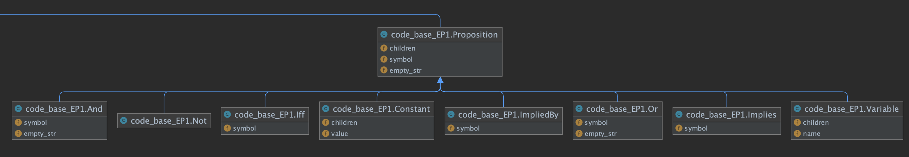
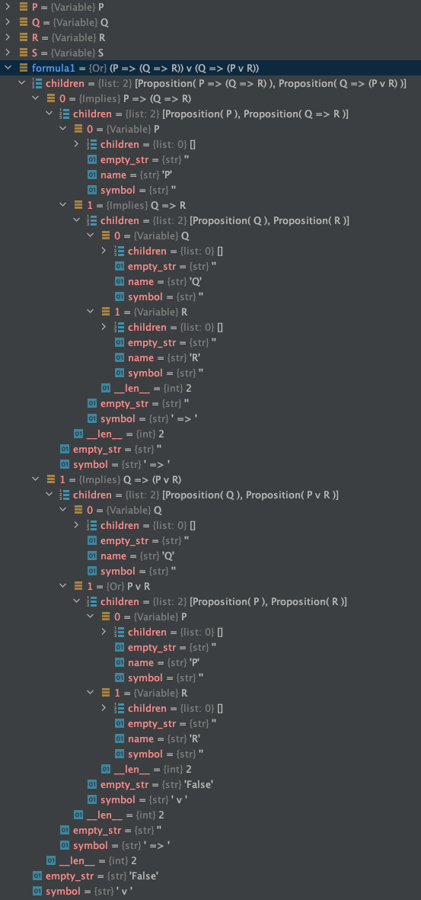
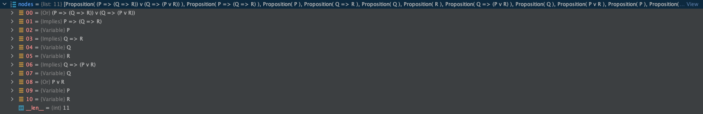
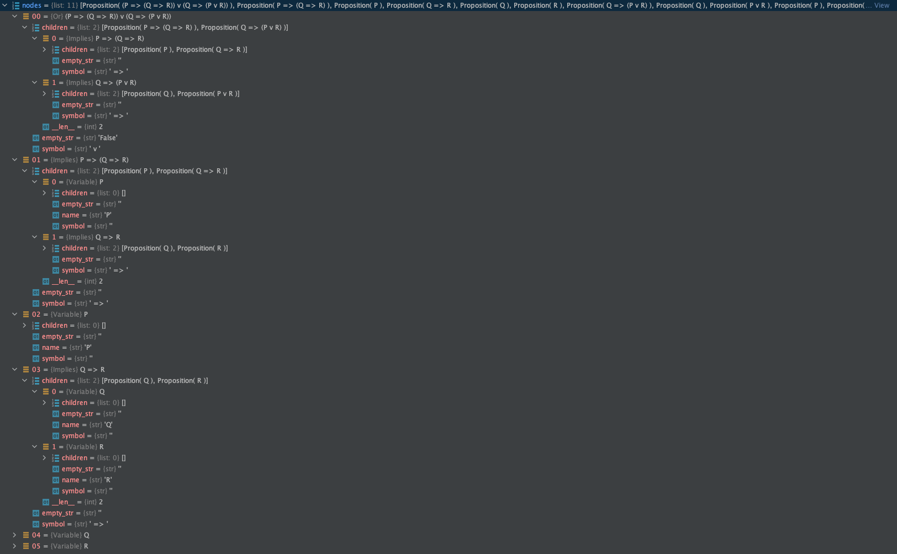
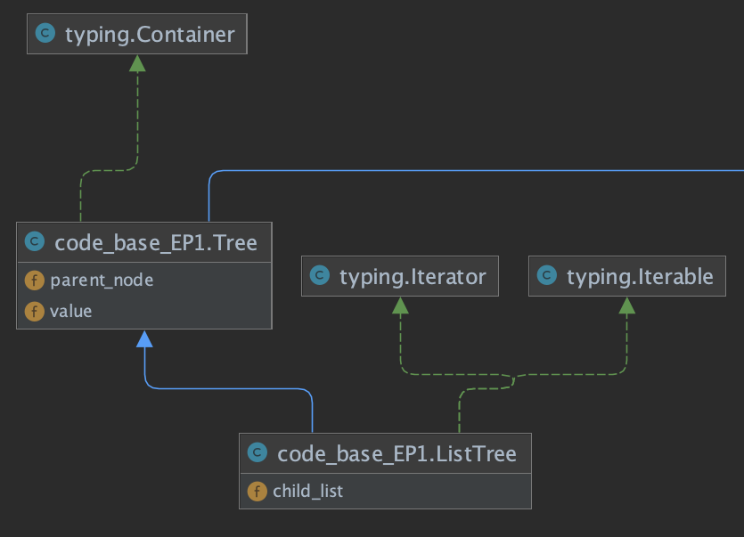
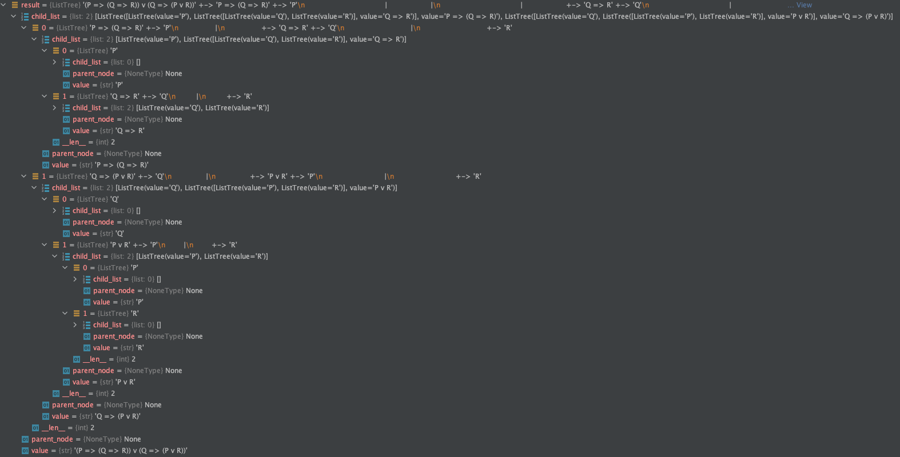
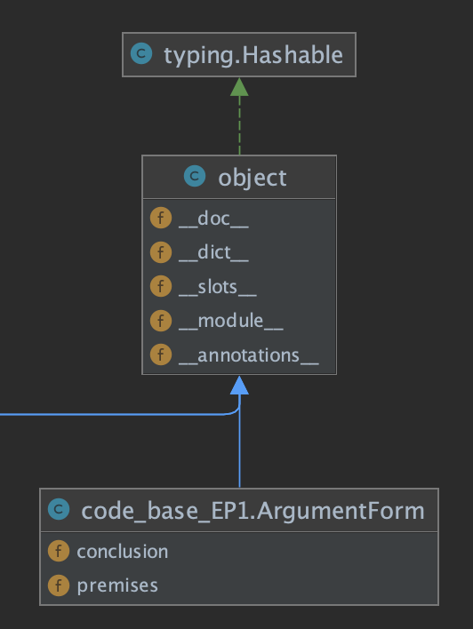

# EP1 - MAC0239

# Estrutura de Dados Base

## Classe Proposição



A classe Proposição para o projeto pode ser considerada como uma Superclasse. Implementa o conceito de proposição da
lógica proposicional: “todo conjunto de palavras ou símbolos que exprimem um pensamento de sentido completo”. O projeto
considera as proposições compostas como entrada, construída a partir de proposições menores (sub formulas) ou átomos (
variáveis). Assim, uma proposição é definida (recebe o tipo) a partir do seu operador lógico principal (que separa a
proposição em duas). Por exemplo: (P >> (Q >> R)| (Q >> (P|R))) onde o separador é or(|). Assim, existe uma subclasse de
Proposição para cada operador que o sistema trabalha: And( ^ ), Or ( | ), Iff ( <=>), Constant (T,F), ImplieBy (<= ),
Implies ( => ), Not(~).

A classe define o atributo children que são as subformulas (também do tipo proposição) que compõem a proposição dada,
representado por um vetor de proposições. No exemplo, children[0] = (P >> (
Q >> R)) e children[1] = (Q >> (P|R)), onde cada um dos childrens são também proposições, eles possuem seus próprios
childrens, como pode ser visto na imagem abaixo:



É possível notar o tipo dessa proposição {Or}, e também que cada children é um objeto do tipo Proposição ou uma
especificação dele, que possuem todos os atributos e métodos de Proposição.

## Classe Variáveis

Subclasse de Proposição, mas sobrescreve o atributo children como vazio, ou seja, não admite subitens, já que representa
o átomo.

## Classe Constantes

Subclasse de Proposição, mas sobrescreve o atributo children como vazio, ou seja, não admite subitens, já que representa
somente T ou F.

## Classes And(^), Not(~), Iff(<=>), ImpliesBy(<=), Implies(=>) e Or(|)

Subclasses do Proposição e todas admitem childrens.

## Função get_nodes(formula)

Recebe um objeto do tipo Proposição, e devolve uma vetor de Proposições (|(or),=>(implies),Var,And,etc) em que cada posição
representa um node com as partes da proposição dada até o segundo nível de cada subformula.

- Extração dos nodes para a fómula: (P >> (Q >> R)| (Q >> (P|R)))
  

- Subformulas em cada node
  

Cada nível no node é um detalhamento da formula anterior, até esgotar todas as subformular encontradas na proposição.

Como cada node é uma proposição é possível montar a tabela verdade para a proposição, chamando o método
node.print_truth_table()
que imprime a tabela verdade:

```
Pra um nó específico: Nó 1
P => (Q => R)
Tabela verdade
  P      Q      R    #  P => (Q => R)
#####################################
True   True   True   #      True
True   True   False  #      False
True   False  True   #      True
True   False  False  #      True
False  True   True   #      True
False  True   False  #      True
False  False  True   #      True
False  False  False  #      True
```

Também é existe um array com as 2^n (n=número de variáveis) combinações das valorações possíveis das e-nuplas de
variáveis, que foi retornado na chamada da função: truth_table_rows(node.variables()).

```
[{'Q': True, 'P': True, 'R': True},
{'Q': True, 'P': True, 'R': False},
{'Q': True, 'P': False, 'R': True},
{'Q': True, 'P': False, 'R': False},
{'Q': False, 'P': True, 'R': True},
{'Q': False, 'P': True, 'R': False},
{'Q': False, 'P': False, 'R': True},
{'Q': False, 'P': False, 'R': False}]
```

2^3 combinações possíveis para uma fómula com 3 variáveis.

## Classe Tree



É uma Superclasse que representa uma estrutura de dados de árvore com nós e folhas, mas esse comportamento não
foi implementado, pois a adição de nos filhos (children) não foi programado (NotImplementedError()).

No programa demo não é instanciada diretamente. É utilizada para imprimir a estrutura de árvore da proposição recebida
pelo programa, quando é invocado o método formula.to_tree(), que devolve na saída padrão a impressão da árvore de
subformulas.

O método pertence a classe Proposition.to_tree(), que se utiliza(instancia) do atributo child_list da Subclasse ListTree
para acumular as proposições de forma hierárquica. Para isso, a classe Tree faz um overload do método ```__str___```,
que devolve a árvore na saída padão, conforme a imagem abaixo.

```
'(P => (Q => R)) v (Q => (P v R))' +-> 'P => (Q => R)' +-> 'P'
                                   |                   |
                                   |                   +-> 'Q => R' +-> 'Q'
                                   |                                |
                                   |                                +-> 'R'
                                   |
                                   +-> 'Q => (P v R)' +-> 'Q'
                                                      |
                                                      +-> 'P v R' +-> 'P'
                                                                  |
                                                                  +-> 'R'
```

## Classe ListTree

É uma Subclasse de Tree. No projeto, o atributo child_list acumula recursivamente em listas as subformulas de uma
proposição usando o método add_child_node(proposicao). O valor padrão vem do método ```__str__``` da classe pai Tree.
Temos então, nessa classe, uma junção de objetos do tipo Proposição e represenção hieráquica da proposição, quando
executado o método to_tree() de uma proposição. O resultado final para imprimir a arvore de subformalas é mostrado
abaixo:



## Classe ArgumentForm

É uma Superclasse que representa uma fórmula que é consequêcia lógica de outra fórmula, ou seja, A implica logicamente
em B. Recebe como entrada os antecedentes (premissas) e sequentes (conclusões), objetos do tipos Proposição. Os
principais métodos são premises e conclusion que imprimem os antecedentes e sequentes, repectivamente. O método
print_truth_table imprime a tabela verdade e o método is_valid_truth_table avalia, a partir da tabela verdade se é um
proposição válida.


